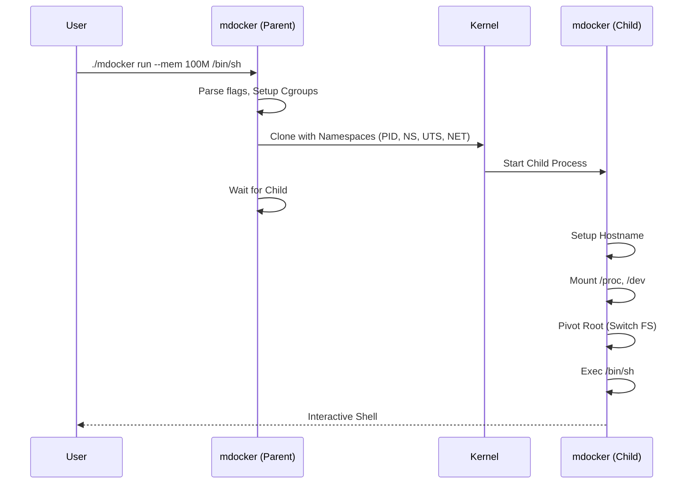

# mdocker: A Minimal Container Runtime

**mdocker** is an educational, minimal container runtime written in Go. It demonstrates the core principles of containerization by interacting directly with Linux kernel primitives—Namespaces, Cgroups, and Pivot Root—without relying on high-level runtimes like Docker or containerd.

This project serves as a practical reference for understanding how containers work "under the hood."

---

## 🚀 Key Features

*   **Namespace Isolation**: Uses Linux Namespaces (`CLONE_NEW*`) to isolate the container's view of the system (PID, Mount, UTS, Network).
*   **Resource Control**: Implements **Cgroups v2** to limit CPU, Memory, and PID usage.
*   **Filesystem Isolation**: Uses `pivot_root` (not just `chroot`) to securely swap the root filesystem, ensuring the container cannot access the host.
*   **Process Management**: Supports running, freezing, unfreezing, and killing containers.
*   **Safety Mechanisms**: Explicitly closes inherited file descriptors to prevent leaking host resources (e.g., DBus sockets) into the container.
*   **Networking**: Basic veth pair setup for network isolation (work in progress).

---

## 🏗️ Architecture

The runtime operates in a two-stage process to ensure proper isolation:

1.  **Parent Process (CLI)**:
    *   Parses user commands and flags.
    *   Sets up Cgroups for resource limits.
    *   Prepares the command to re-execute itself with specific namespace flags (`CLONE_NEWPID`, etc.).
    *   Configures networking (veth pairs).

2.  **Child Process (Container)**:
    *   Starts inside the new namespaces.
    *   Sets the hostname.
    *   Mounts `/proc`, `/sys`, and `/dev`.
    *   Performs `pivot_root` to switch to the container's root filesystem.
    *   Executes the user's requested command (e.g., `/bin/sh`).



---

## 🛠️ Installation & Usage

### Prerequisites
*   **Linux**: Kernel 4.18+ (for Cgroups v2 support).
*   **Go**: Version 1.18+.
*   **Rootfs**: A minimal root filesystem (e.g., Alpine Linux included in repo) extracted to a `rootfs` directory in the project root.

### Clone the repository:
```bash
git clone https://github.com/Dibya1407/mdocker.git
cd mdocker
```

### Build
```bash
go build -o mdocker .
```

### Running a Container
Run a shell inside the container with limits:
```bash
# Run with 100MB memory limit and 20% CPU limit
sudo ./mdocker run /bin/sh --mem 100M --cpu 20
```

You should get:
```bash
container pid: <container-pid>
/bin/sh: can't access tty; job control turned off
/ # 
```

### Managing Containers
From another terminal in the same directory as mdocker, you can manage the container:
(Use the container pid displayed on starting the container)

**Freeze** a running container (pauses all processes):
```bash
sudo ./mdocker freeze <container-pid>
```

**Unfreeze** a container:
```bash
sudo ./mdocker unfreeze <container-pid>
```

**Kill** a container:
```bash
sudo ./mdocker kill <container-pid>
```

---

## 🧠 Technical Deep Dive

### 1. Linux Namespaces
`mdocker` uses the `syscall` package to pass clone flags when starting the child process. This creates new instances of global resources:
*   **Implementation**: In `internal/container/run.go`, the `parent()` function configures `cmd.SysProcAttr` with:
    *   `CLONE_NEWPID`: Process IDs are reset (container sees itself as PID 1).
    *   `CLONE_NEWNS`: Mount points are isolated.
    *   `CLONE_NEWUTS`: Hostname is isolated.
    *   `CLONE_NEWNET`: Network stack is isolated.

### 2. Cgroups v2
Resource limits are applied by writing to the Unified Hierarchy at `/sys/fs/cgroup/mdocker`.
*   **Implementation**: The `setupCgroup()` function in `internal/container/cgroups.go` handles this:
    *   **Memory**: Writes limit to `memory.max`.
    *   **CPU**: Calculates quota based on percentage (100000us period) and writes to `cpu.max`.
    *   **Pids**: Writes max process count to `pids.max` to prevent fork bombs.

### 3. Filesystem Isolation (Pivot Root)
Instead of `chroot`, we use `pivot_root`. This is more secure because it completely swaps the mount table.
*   **Implementation**: The `child()` function in `internal/container/run.go` performs the following:
    1.  **Bind Mount**: `syscall.Mount(rootfs, rootfs, ...)` to ensure the new root is a mount point.
    2.  **Pivot**: `syscall.PivotRoot(rootfs, putOld)` moves the old root to `.old_root` and swaps in `rootfs`.
    3.  **Cleanup**: `syscall.Unmount("/.old_root", ...)` removes the old host filesystem reference.

### 4. Networking (Veth Pairs)
`mdocker` implements basic bridge-less networking using **Virtual Ethernet (veth)** pairs.
*   **Implementation**: The `parent()` function sets up the network *after* the child process starts (but before it runs the user command):
    1.  **Creation**: Creates a pair `veth-host` <-> `veth-cont`.
    2.  **Assignment**: Moves `veth-cont` into the child's network namespace using `ip link set ... netns <pid>`.
    3.  **Addressing**:
        *   Host (`veth-host`): Assigned `10.0.0.1/24`.
        *   Container (`veth-cont`): Assigned `10.0.0.2/24` using `nsenter` to run `ip` commands inside the child namespace.
    4.  **Routing**: Sets the default route inside the container to point to the host (`10.0.0.1`).

## Challenges Faced
### 1. Leaking File Descriptors
A critical issue I faced is FD leakage. If the parent process has open connections (e.g., to a database or window manager), the child inherits them.This causes problems in the host system.

While trying to implement pty(Pseudo Terminal), i faced the same issue, all my applications get closed,not even the terminal works, leading me to force power off my system.Then that caused ntfs mount problems on reboot, Which I had to fix on windows using chkdsk.This is the core reason why i stopped working on implementing pty.

### 2. Root Filesystem (rootfs) Corruption and Exec Errors

Containers failed with:
```bash
fork/exec /bin/sh: exec format error
```
On changing development environment from windows to linux, 

Root Cause
- rootfs was copied from a Windows environment
- Line endings and binary formats were corrupted (CRLF vs LF)
- Some binaries inside rootfs were no longer valid ELF executables

*Fix*
- Restored rootfs from a Linux backup
- Avoided modifying rootfs on Windows
- Added rootfs to .gitignore to prevent accidental changes

Learned that container filesystems must always be built on Linux.

---

## Use of AI Tools in the Project
Why I Used AI

While building this container runtime, I worked extensively with low-level Linux concepts such as namespaces, cgroups, mount propagation, and process lifecycle management. These topics involve kernel interfaces and system calls that are often difficult to understand through documentation alone.

I used AI tools as a learning and guidance aid, similar to consulting technical blogs, documentation, or experienced developers. The purpose was not to generate the project automatically, but to clarify concepts, understand unexpected system behavior, and speed up the learning process while debugging complex issues.

### How I Used AI

I used AI assistance in a limited and controlled manner, mainly during the learning and debugging phases of the project. Specifically, I used AI for:

#### Concept Clarification
- Understanding how Linux namespaces and cgroups work internally  
- Learning the difference between `chroot` and `pivot_root`  
- Understanding PID 1 behavior and zombie process reaping  
- Interpreting mount propagation flags and their effects  

#### Debugging Support
- Interpreting runtime errors and namespace-related failures  
- Identifying likely causes of failures rather than receiving direct code fixes  
- Getting suggestions on which subsystem (filesystem, networking, namespaces) to investigate  

#### AI-Assisted Code Writing (Limited and Specific)
Some portions of the code were **initially written with AI assistance**, particularly in cases where the code was:
- Repetitive or boilerplate in nature  
- Focused on low-level file operations (for example, writing values into cgroup control files)  
- Required for interacting with kernel interfaces that follow a fixed, well-defined pattern  

Examples include:  
- Small helper functions for repetitive filesystem operations  
- Basic wrappers around syscalls or file writes where the logic itself was not conceptually complex  

All such code was **reviewed, modified where necessary, and fully understood** before being integrated into the project.


#### Use of Unfamiliar or Highly Specific Libraries
In a few cases, AI was used to help write code involving **libraries or system interfaces that were completely new to me** and were required only for **very specific purposes** within the project.


#### Validation of My Approach
All implementation decisions and code changes were made by me after understanding the reasoning behind them. Every suggestion was tested and verified on my local Linux system.


